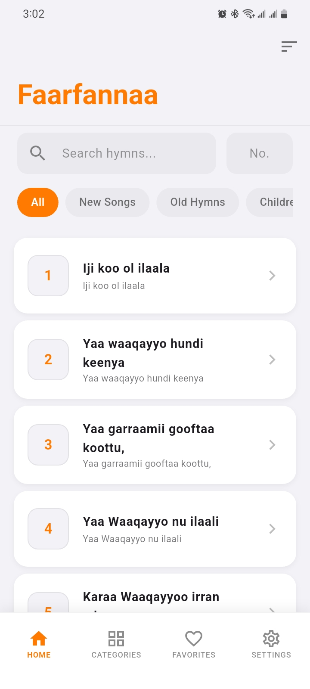
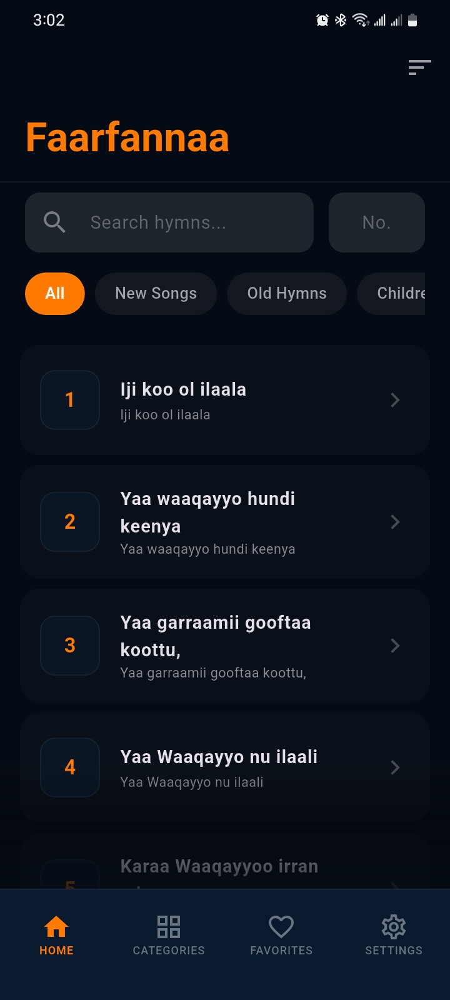

# Faarfannaa Galata Waaqayyoo


**Faarfannaa Galata Waaqayyoo** (Praise Songs of God) is a spiritually enriching mobile application designed for browsing, reading, and meditating on hymns in the Oromo language. Featuring a comprehensive collection of traditional "Faarfannaa", the app offers an intuitive interface with robust tools for navigation, search, and personal customization.

## Features

- **📖 Extensive Hymn Collection**: Browse a vast library of hymns organized by categories.
- **🔍 Smart Search**: Quickly find songs by title or hymn number.
- **❤️ Favorites**: Mark hymns as favorites for quick access.
- **📂 Categorized Views**: Explore songs grouped by themes or occasions.
- **🌓 Dark & Light Mode**: Seamlessly switch between light and dark themes for comfortable reading in any environment.
- **📱 Responsive Design**: Optimized for both Android and iOS devices.

## Screenshots

| Home (Light) | Home (Dark) | Category |
|:---:|:---:|:---:|
|  |  |  |


## Getting Started

Follow these instructions to get a copy of the project up and running on your local machine for development or testing purposes.

### Prerequisites

- [Flutter SDK](https://flutter.dev/docs/get-started/install) installed.
- An IDE (VS Code or Android Studio) with Flutter execution capabilities.
- [Git](https://git-scm.com/) installed.

### Installation

1. **Clone the repository:**
   ```bash
   git clone https://github.com/lati-tibabu/faarfannaa_galata_waaqayyoo.git
   cd faarfannaa_galata_waaqayyoo
   ```

2. **Install dependencies:**
    ```bash
    flutter pub get
    ```

3. **Run the application:**
    ```bash
    flutter run
    ```

## Project Structure

```
lib/
├── main.dart           # Entry point
├── theme.dart          # App Theme definition
├── models/             # Data models (Hymn, Category)
├── screens/            # UI Screens (Home, Category, Detail, Splash)
└── services/           # Logic services (SongService, JSON parsing)
assets/
└── songs/              # JSON data files for hymns
```

## Contributing

Contributions are welcome! If you have suggestions or improvements, please fork the repository and create a pull request.

1. Fork the Project
2. Create your Feature Branch (`git checkout -b feature/AmazingFeature`)
3. Commit your Changes (`git commit -m 'Add some AmazingFeature'`)
4. Push to the Branch (`git push origin feature/AmazingFeature`)
5. Open a Pull Request

## License

Distributed under the GNU General Public License v3. See `LICENSE` for more information.

---
Developed by **Lati Tibabu**
